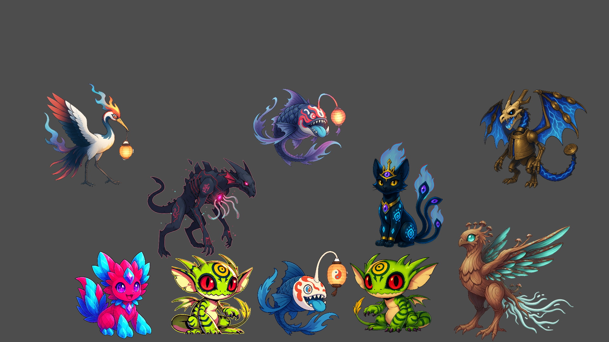

# Gojomons

A roguelike auto-battler creature game built in Godot 4.5 / GDScript. You draft a
team of original creatures over a run, pick up relics and items along the way, and
watch fast auto battles decide whether the build holds. The shape is capture,
route pressure, shop choices, and draft synergies in one run-based structure.

A personal project, in active development. This repo is a showcase of it, not a release.

### Main menu

https://github.com/user-attachments/assets/002a4908-96f4-4c86-a180-8253683c4f1a

I work on this solo: art, design, and code. AI has sped up prototyping art and
code and testing styles; figuring out how to balance that speed against quality
and coherence has been part of the work. I've been prototyping games in Godot for
about five years; this project started in summer 2025, so its commit history is
much shorter than the time I've spent in the engine. Most of the art is still at
the prototype stage.

---

## What it is

The strategy lives in building the team, not in micromanaging each fight. Battles
resolve on their own, so you win or lose on drafting, routing, and synergies.

- **Roguelike runs.** Start a run, pick a master and a starter, then move through
  towns (shop, heal, choose where to go next) and routes (chains of rooms and
  events) toward a boss. Towns and routes are decision spaces, not a free-roam
  overworld.
- **Auto battles.** Combat plays out automatically, meant to be fast and readable.
  Low input, high strategy.
- **Relics and items.** Run-modifying pickups that hook into combat and bend the
  math.
- **Custom type system.** 9 elements (Fire, Water, Life, Machine, Storm, Mystic,
  Light, Dark, Alien) on a hand-built chart, plus a neutral `Base` element that
  ignores same-type attack bonus and the chart.
- **Masters.** Element-themed run identities, each with their own specialization
  and starter.
- **Creatures.** A mix of spirits, archetypes, and more ordinary critters, each
  with a type, an aspect, and a combat style.

---

## Scale

| | |
|---|---|
| Lines of GDScript | ~35,300 |
| Scripts (`.gd`) | 195 |
| Scenes (`.tscn`) | 80 |
| Creatures | 64 |
| Moves | 90 |
| Items | 49 |
| Relics | 32 |
| Elements | 9 + neutral `Base` |

*Snapshot: 2026-06-14. Counts follow the source game repo's generated
`DOCUMENTATION/data/game_manifest.json` and `DOCUMENTATION/data/project_facts.json`.*

---

## How it's built

### Event-driven combat

Combat is wired through a central `EventDispatcher` (pub/sub) instead of direct
calls between subsystems.

```gdscript
EventDispatcher.register(GameEvents.SOME_EVENT, Callable(handler, "_method"))
EventDispatcher.emit(GameEvents.SOME_EVENT, context_dict)
```

Handlers get a single `Dictionary` context. Relics, items, and master passives
read that context and adjust it in place to inject their modifiers. Adding a new
relic means registering a handler, not editing the damage code. Background is in
[docs/design/event-driven-combat-architecture.md](docs/design/event-driven-combat-architecture.md).

### Pure rules layer

Damage, type effectiveness, hit chance, and effect application are static
functions with no side effects beyond emitting events. Because they don't touch
the scene tree, the same logic runs headless, which is what the tests and the
balance simulator use.

### Tests and balance tooling

A headless runner (`godot --headless`) checks the combat rules, type chart, and
game state with roughly 1,500 assertions. Since battles auto-resolve, the same
rules also drive a headless simulator that replays fights to measure win rates,
which I use to find balance outliers. See
[docs/design/balance-by-simulation.md](docs/design/balance-by-simulation.md) and
[docs/design/symmetrical-type-chart.md](docs/design/symmetrical-type-chart.md).

### Battle pipeline

```
BattleController
  build BattleState from run state
  loop until battle over:
    PreCombat    spawn battlers, load encounter, music/bg
    TurnManager  intents -> move resolution -> effects -> VFX
    PostTurn     KO detection, switches, win/loss check
```

---

## Roadmap

The documentation index is in [`docs/README.md`](docs/README.md). The older
interactive checklist is in
[`docs/roadmap/pipeline_view.html`](docs/roadmap/pipeline_view.html), grouped by
system area. The cleaner current documentation plan is in
[`docs/roadmap/showcase-documentation-plan.md`](docs/roadmap/showcase-documentation-plan.md),
with a current return handoff in
[`docs/roadmap/current-state.md`](docs/roadmap/current-state.md). The generated
[`Living Game Bible`](docs/game-bible/living-game-bible.html) is the current
interactive reference for the game shape, pipeline, roster, types, bestiary,
masters, economy, catalog, bosses, balance, and roadmap.
Rough state right now:

- **Working:** master selection, starter trail, town day loop, shops, PC, route
  fights, capture, relic rewards, 1v1 and selected 2v2 battles, gyms, final boss,
  and the shared combat rules used by the simulator.
- **In progress:** live UI integration for the richer decision graph, clearer
  route telegraphs, elite skill checks, town services, combat readability, and
  replacing temporary media with original work.
- **Planned or banked:** deeper type services, item and relic quality, stronger
  build synergies, world travel, authored events, roster pressure, cosmetic
  unlocks, challenge modes, and later meta-progression.

It's early, and a lot of the design is still open.

---

## Project layout

```
DATA/        run-wide state, save system
SYSTEMS/
  battle/    combat pipeline (controller, turn manager, effects, UI)
  gojomons/  creature + move resources, species DB, rules layer
  moves/     move definitions
  items/  relics/  masters/   content databases
  map/  towns/  routes/  campaign/  encounters/   the run loop
  core/      event dispatcher, rates, config
UI/          menu/scene router
```

---

## Showcase

### Creatures

https://github.com/user-attachments/assets/37fd310a-7f81-4918-bca0-5bf175075fe9

*Catra, the current flagship Gojomon.*



*Some early Gojomon prototypes.*

### Combat

https://github.com/user-attachments/assets/6949fa0d-eae7-488f-94ff-aa767a7bdbc2

An early combat showcase, 2v2. Battles auto-resolve; I'm still working on how they
read: layout, pacing, animation, and impact. The target is a mix where 2v2 is a
recurring minority format, not the whole game.

### Party menu

https://github.com/user-attachments/assets/c3c74b29-404c-4d1b-a405-19657dc0aac6
